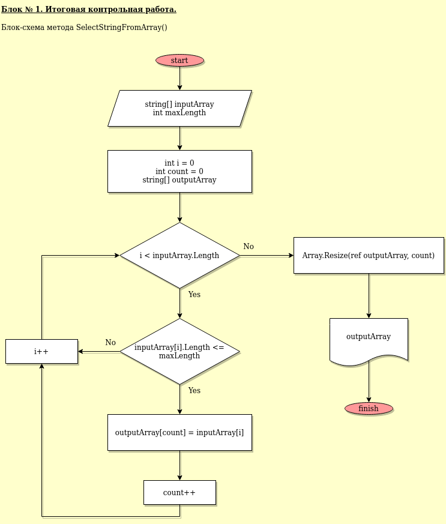

# Блок № 1. Итоговая контрольная работа
+ [Текст программы](B1-TestWork.cs)
+ [Блок-схема основного метода в формате .drawio](B1-TestWork.drawio)
***
## Описание алгоритма основной (содержательной) части программы
Основной функционал реализуется в методе `SelectStringsFromArray()`, который принимает на вход три аргумента:
- `string[] inputArray` - заданный массив строк;
- `string[] outputArray` - итоговый массив. Т.к. размер этого массива изначально неизвестен, то ссылка на него передается с ключевым словом `out`. Т.о. у меня есть возможность объявить этот массив в теле основной программы без указания размера;
- `int maxLength` - длина строки, являющаяся условием для выбора из исходного массива.

Объявляется счетчик `count` с начальным значением `0`. В нем будет хранится количество строк исходного массива, удовлетворяющих заданному условию по максимальной длине.  
Далее инициализируется итоговый массив. Ему выделяется память, равная длине исходного массива.  
В цикле `for` пробегаем по элементам входного массива, если очередная строка удовлетворяет заданному условию, мы копируем ее в выходной массив в элемент с индексом `count` и инкрементируем этот счетчик.  
Таким образом, после выполнения цикла, в выходном массиве начиная с индекса `0` будут хранится отобранные строки нужной длины. Если их количество меньше, чем общее количество элементов в исходном массиве, то оставшиеся позиции будут иметь значение `NULL`.  
Чтобы не занимать лишнюю память, необходимо избавиться от пустых строк. Для этого применяется метод `Resize` из пространства имен `System`, в качестве аргументов которому передается сам массив и новое значение размера. Этим новым значением будет величина счетчика `count`. т.е. количество строк, отобранных по заданному условию.  
**Блок-схема метода `SelectStringsFromArray():`**
